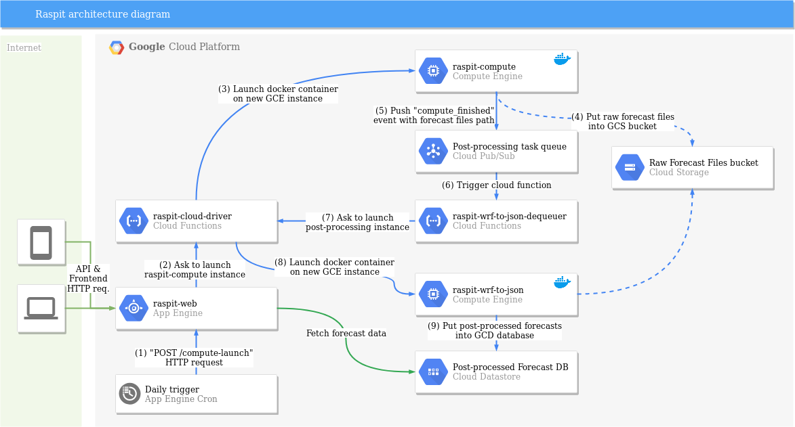

# Raspit

Soaring weather forecast web distribution

## Components

### raspit-cloud-driver

Bundles two Google Cloud Functions, triggered by HTTP calls :
* **launch_instance** : Spins up a Google Compute Engine instance, and starts a specific docker container on it ;
* **delete_instance** : Stops and deletes a specific instance. 

#### How to deploy
```shell
$ gcloud beta functions deploy launch_instance --runtime python37 --trigger-http
$ gcloud beta functions deploy delete_instance --runtime python37 --trigger-http
```

### raspit-compute-image

WRF-ARW Weather forecast compute image for SW France. Include 2 docker images :
* Docker-rasp-wrfv3/ : Generic wrfv3 rasp dockerfile (for development purpose) ;
* Docker-raspit-compute/ : "Production" image, derived from the above. Does a run for the next 3 days upon startup, transfer the data generated to Cloud Storage and kills the host (via a raspit-cloud-driver call) when done.

Uses two different domains :
* PYR2/ : 1-stage 0.5deg GFS initialized 6km grid, for days n+2 and n+3 ;
* PYR3/ : 1-stage 0.25deg GFS initialized 3km grid, for day n+1.

#### How to deploy
```shell
$ cd raspit-compute/Docker-rasp-wrfv3
$ wget http://rasp-uk.uk/SOFTWARE/WRFV3.x/raspGM.tgz
$ wget http://rasp-uk.uk/SOFTWARE/WRFV3.x/raspGM-bin.tgz
$ wget http://rasp-uk.uk/SOFTWARE/WRFV3.x/rangs.tgz
$ docker build -t rasp-wrfv3 .
$ cd ../Docker-raspit-compute
$ docker build -t gcr.io/<gcp_project_id>/raspit-compute .
$ docker push gcr.io/<gcp_project_id>/raspit-compute
```

#### How to start a development container

```
$ cd raspit-compute/Docker-raspit-compute
docker run -it \
    -e "DEV_ENV=y" \
    -v $(pwd):/root/rasp/Raspit-compute-image \
    rasp-wrfv3
```


### raspit-web

Google App Engine flask-based webserver. Also includes an App Engine cron job, that calls the /compute-launch (see below) route daily.

#### Routes

* / : User endpoint ;
* /forecast : Returns JSON forecast data fetch from Google Cloud Datastore ;
* /compute-launch : Triggers a forecast run, via a launch_instance Cloud Function call.

#### How to deploy

```
$ cd raspit-web
$ gcloud app deploy
$ gcloud app deploy cron.yaml
```

### raspit-wrf-to-json
WRF post-processing docker image. Upon startup, pulls events from a Google Pub/Sub queue, that corresponds to raw wrfout files that need to be processed. The processing corresponds to extracting and interpolating values from the wrfout files (fetch from Google Cloud Storage), put it in JSON format, and send the result to Google Cloud Datastore.

#### How to deploy

```shell
$ cd ../raspit-wrf-to-json
$ docker build -t gcr.io/<gcp_project_id>/raspit-wrf-to-json .
$ docker push gcr.io/<gcp_project_id>/raspit-wrf-to-json
```

## Simplified architecture diagram



## Based on the work of

* Dr Jack : [RASP](http://www.drjack.info/RASP/), a WRF-ARW forecast distribution ;
* V. Mayamsin : [Rasp docker scripts](https://github.com/wargoth/rasp-docker-script)
